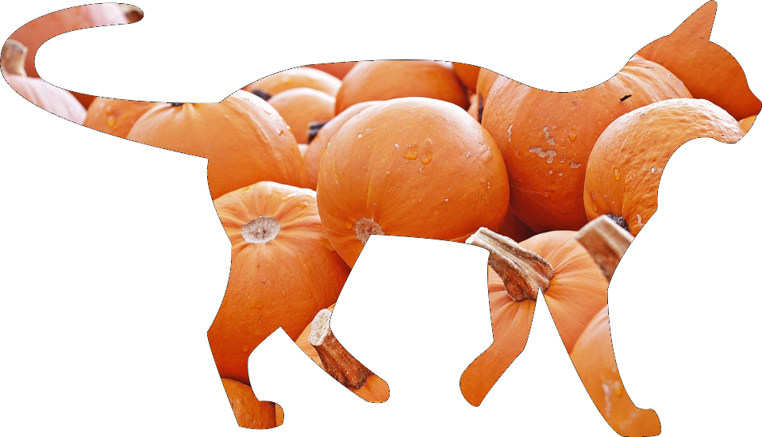
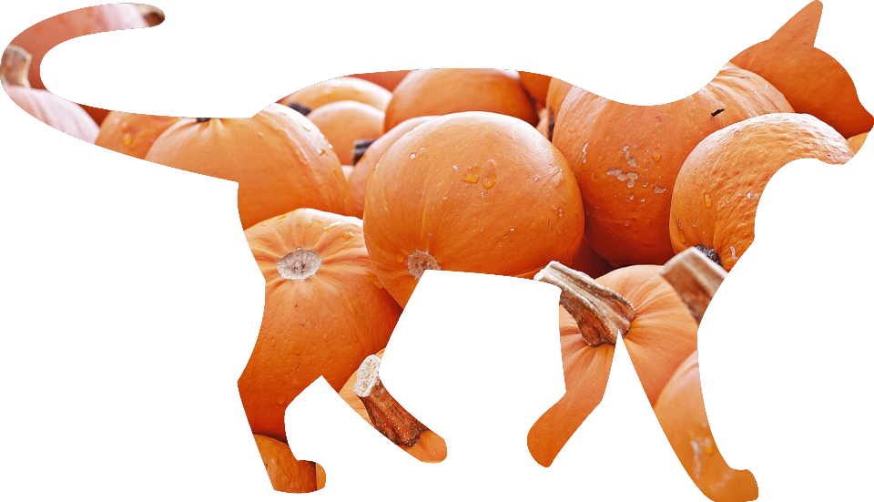
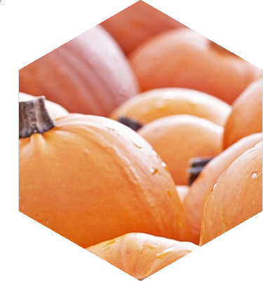
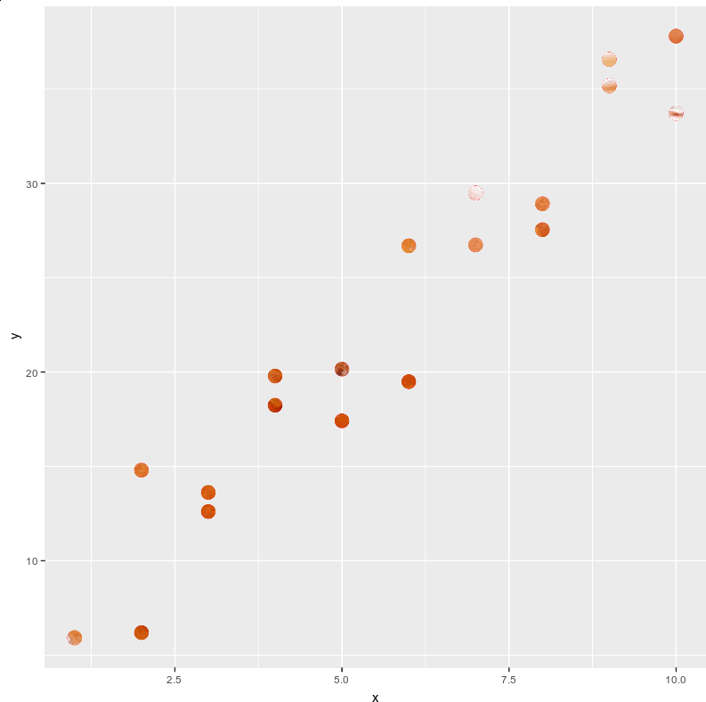

<!-- README.md is generated from README.Rmd. Please edit that file -->

# cuttingshapes

<!-- badges: start -->

<!-- badges: end -->

The goal of cuttingshapes is to make it easier to cut shapes out of
images.

## Installation

You can install the development version of cuttingshapes from
[github](https://github.com/annafergusson/cuttingshapes) with:

``` r
devtools::install_github("annafergusson/cuttingshapes")
```

## Example

This is a quick example of cutting a cat shape out of an image of
pumpkins. Because it’s Halloween\!

``` r
library(cuttingshapes)
cut_shape(image = "https://cdn.pixabay.com/photo/2019/09/08/19/01/pumpkin-4461665_1280.jpg",
          shape = "https://imageog.flaticon.com/icons/png/512/30/30209.png?size=1200x630f&pad=10,10,10,10&ext=png&bg=FFFFFFFF")
```

 If you want
to make the edges smoother, increase the fuzz factor from the default
(but not too
much\!).

``` r
cut_shape(image = "https://cdn.pixabay.com/photo/2019/09/08/19/01/pumpkin-4461665_1280.jpg",
          shape = "https://imageog.flaticon.com/icons/png/512/30/30209.png?size=1200x630f&pad=10,10,10,10&ext=png&bg=FFFFFFFF",
          fuzz = 60)
```



With the `magick` package you can do some more cool things. Maybe the
image you want to use as the shape is not black and white?

First reduce the image down to two colours, then convert to black and
white. Oh yeah, you can also supply an image-magick external pointer
object as an argument\!

``` r
library(magick)
pumpkins <- "https://cdn.pixabay.com/photo/2019/09/08/19/01/pumpkin-4461665_1280.jpg"
r_logo <- image_read("https://upload.wikimedia.org/wikipedia/commons/thumb/1/1b/R_logo.svg/1448px-R_logo.svg.png")
r_logo %>% image_quantize(max = 2) %>% image_convert(type = "bilevel") -> r_logo
cut_shape(image = pumpkins,
          shape = r_logo)
```


You can also create some text to cut out of the pumpkins\! Just make
sure the background color is set when you create a blank image.

``` r
word <- image_blank(width = 800, 
                    height = 200,
                    ) %>%
  image_background("#FFFFFF") %>%
  image_annotate("HALLOWEEN", 
                 color = "#000000", 
                 size = 100, 
                 location = "+1+1")
cut_shape(image = pumpkins,
          shape = word,
          fuzz = 80)
```


Or make a hexagon shape cutter\!

``` r
radius <- 200
hex <- image_blank(800, 800) %>%
  image_background("#ffffff") %>%
  image_draw()
polygon(x = c(radius, radius + sin(pi/3)*radius, radius + sin(pi/3)*radius, radius, radius - sin(pi/3)*radius, radius - sin(pi/3)*radius), 
        y = c(0, cos(pi/3)*radius, 2*radius - cos(pi/3)*radius, radius*2, 2*radius - cos(pi/3)*radius, cos(pi/3)*radius), 
        col = "#000000")
nope <- dev.off()
cut_shape(image = pumpkins,
          shape = hex,
          fuzz = 80)
```



We can also take a plot and cut shapes using this. Note that this time,
the colour to use for identifying the shapes to cut has been defined.

``` r
library(tidyverse)
plot <- image_graph(width = 800, 
                    height = 800,
                    res = 96)

data <- tibble(x = rep(1:10, 2),
               rand_error = 10*runif(20),
              y = 3*x + rand_error)

ggplot(data) +
    geom_point(aes(x, y), 
             color = "#ff0000",
             fill = "#ff0000",
             size = 5)
nope <- dev.off()

cut_shape(image = pumpkins,
          shape = plot,
          color = "#ff0000",
          fuzz = 30)
```



And we can use the animation features of `magick` to do even more scary
stuff\!


